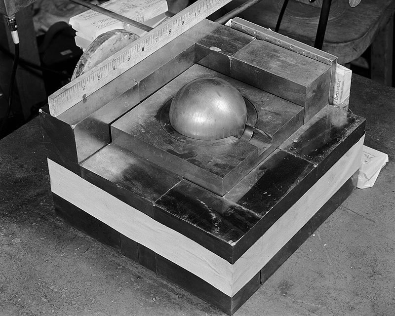
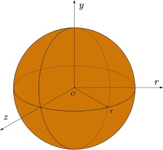

# Spherical Neutron Transport FDM  vs. FEM

UMass Lowell Spring 2022  
Dept. of Chemical Engineering, Nuclear Program  
Engy-5050: Advanced Reactor Physics

View the project on `NBViewer`: 

Run the project on `Binder`: 

 >[Anthony G. Bowers](https://github.com/AnthonyB08), and [Andrew Hamel](https://github.com/anhamel)  
 >[Dept. of Chemical Engineering (Nuclear Energy)](xxx)  
 >University of Massachusetts Lowell, USA  

|  |
|:---:|
|  |
| 
<b> Results.</b>
 |
|  |
| 
<b>Problem domain sketch.</b>
 |
References:

- [1] V. F. de Almeida, [*Engy-50500: Advanced Reactor Physics*](https://github.com/dpploy/engy-5050),  University of Massachusetts Lowell, Dept. of Chemical Engineering (Nuclear Energy Program).
- [2] Multiphysics Object-Oriented Simulation Environment [(MOOSE)](https://mooseframework.org)

